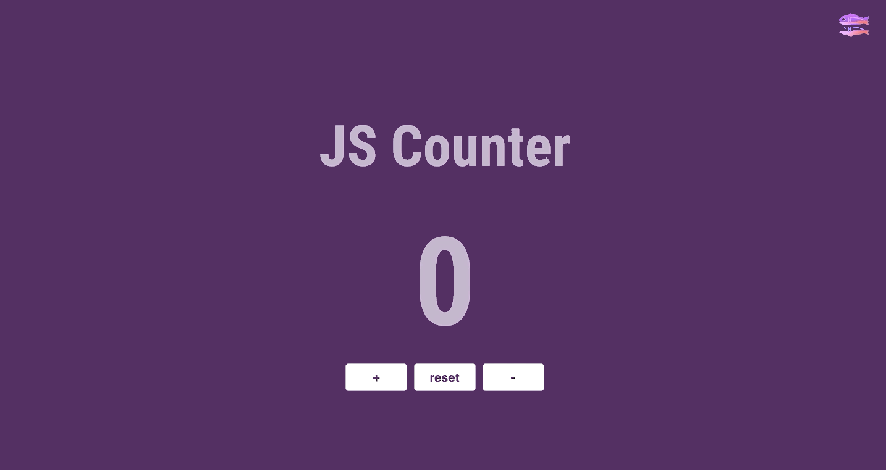

# Counter JS

## Desafio 🎯
Criar uma página com um contador e três botões que atendam as seguintes regras:
  - Um botão "+": quando pressionado adiciona mais um ao contador;
    - Quando o contador tiver o valor zero e esse botão for pressionado, o contador permanece zerado.
  - Um botão "-": quando pressionado remove um do contador;
  - Um botão "reset": quando pressionado zera o contador;

## Por onde posso começar? 💪🏽
- Você pode usar:
  - [Codepen](https://codepen.io/) - O codpen é um editor de código on-line muito utilizado, onde você pode armazenar e compartilhar os seus códigos. Para obter mais detalhes você pode acessar [esse link.](https://blog.codepen.io/2016/02/01/learn-how-the-editor-works-the-editor-tour/)
  - [Glitch](https://glitch.com/) - pra saber o que é o Glitch você pode [entrar aqui](https://medium.com/glitch/what-is-glitch-90cd75e40277), você encontra maiores informações sobre o Glitch [aqui também.](https://medium.com/@glitch)

## Manda umas dicas aí! 😱

---

## Se você achou legou esse desafio e tentou fazer, adiciona aqui o link da tua solução pra gente ver também 😍

## Quem já fez???
