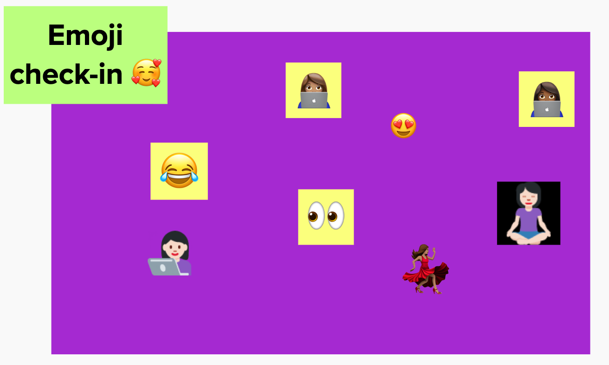

# DOJO #01

# Quebrando o gelo!

Represente com um emoji como você está se sentindo!

# O que é DOJO?

- [Esse site](http://dojopuzzles.com/) tem uma bre descrição do quw é DOJO.

# Vamu ver uns paranauês de CSS Grid na prática?

- [x] criando um grid de 2 colunas (2fr, 1fr)
- [x] Adicionando 10 linhas de 50px e uma com 1fr
- [x] Deixando a imagem responsiva com object-fit
- [x] Definindo a altura da imagem como 100% do display
- [x] Alinhando os botões com `justify-self: flex-end;` e `align-self: center;`
- [x] Alocando cada elemento no grid

# Hora do DOJO ?

- [x] Já temos uma aplicação no codesandbox para iniciar esse DOJO.
- [x] Vamos começar transformando o componente `App` numa arrow function.
- [x] Vamos consumir logo a api e ver se os dados estão chegando como esperado.
  - [x] Dentro do `App` crie duas variáveis com o nome `data e setData` usando o `useState`.
    - [x] Uma para salvar os dados que vamos consumir da `api` e outra que vai receber a função pra manipular os dados que vem da `api`.
  - [x] Agora vamos usar o `useEffect` pra fazer a chamada da `api` .
    - [x] Vamos usar essa [URL](https://api.spacexdata.com/v3/rockets) , mas antes de consumir a url, vamos abrir ela no browser pra ter uma ideia de como os dados que vamos consumir estão estruturados.
    - [x] Dentro do `useEffect` vamos criar uma função com o nome `fetchData` pra fazer a chamada a `api` .
    - [x] Vamos usar o `fetch` do JS em lugar da biblioteca `axios`.
    - [x] Dentro da função `fetchData` vamos criar uma variável com o nome `response` pra receber o retorno da chamada da `api`, vamos usar usar o `async - await`.
    - [x] Ainda dentro do `fecthData` vamos criar uma variável chamada `responseData` que vai receber o retorno da variàvel response, nesse formato `response.json()` , não vamos esquecer o await antes do response.
    - [x] Vamos chamar a função `setData` passando o valor de `responseData`.
    - [x] Pra ver os dados sendo carregados vamos chamar a função `fetchData` dentro do `useEffetc`.
  - [x] Vamos chamar o `console.log` antes da função `return` e passar a variável `data` pra ter certeza que os dados estão chegando como esperado.
  - [x] Hummmm conseguimos ver no `log` que algo não está funcionando corretamente, tem um loop infinito rodando, isso acontece porque temos que informar pra o `useEffect` as dependências e caso não tenhamos dependências temos que passar um array vazio.
- [x] Agora já temos os dados na nossa variável `data`, vamos mostrar eles na tela?
  - [x] A primeira coisa que podemos tentar poderia ser acessar a url da imagem para passar no src do `img`, pra isso a gente pode olhar no `console.log` e procurar a propriedade `flickr_images` , ela é um array então vamos pegar o primeiro elemento do array.
  - [x] Hummm... acho que temos q validar primeiro se os dados já chegou no nosso array antes de mostrar na tela, vamos fazer isso usando a expressão `{meuArray && <>aqui vai o bloco como HTML</>}`.
  - [x] Hummm... após adicionar o `` se tentarmos adicionar um `
` acontece um erro porque estamos tentando mostrar mais de um elemento sem o um `nó` envolvendo eles, vamos envolvê-los em um `fragment`.
  - [x] Se tiver tudo ok, podemos apresentar uma imagem, um título e uma descrição da imagem, lembre-se de colocar um `alt` para imagem.
- [x] Prontinho, já temos os dados na tela, só que temos apenas os dados de um index do array, se quisermos ver o próximo dado teremos que mudar o index... Humm... Vamos criar uma função e adicionar uns botões pra mudar o index quando clicarmos nele e automagicamente mudará os dados que estão sendo apresentados na tela 🌚.
  - [x] Vamos começar colocando os botões na tela pra isso vamos importar a biblioteca `react-icons`.
  - [x] Vamos usar esses dois componentes `{ FaAngleRight, FaAngleLeft }` importando de `react-icons/Fa`.
  - [x] Agora podemos usar cada icon que importamos dentro de um botão.
  - [x] Vamos criar duas variáveis chamadas `page, setPage` usando o `useState` onde uma irá guardar o valor do index e a outra será a função pra atualizar esse valor.
  - [x] Agora vamos usar o evento `onClick` nos botões e passar a função `setPage` recebendo os valores de `page + 1` e `page - 1` pra quando clicarmos no botão ele fazer alteração da valor de `page`.
  - [x] Vamos ver no `console.log(page)` se isso está funcionando como esperado.
- Agora vamos trocar cada index onde estamos acessando o valor de `data` pela variável `page`.
- E tcharammmm temos um app de slide carregando dados de uma api, incrível né mesmo?

> Obrigada por ter chegado até aq 🌻 e mantenha o foco na prática, pois é a melhor forma de aprender algo novo.

# Referências

- [Adeus Flexbox, bem vindo CSS Grid Layout!](https://codepen.io/simoneas02/post/grid-layout)
- [CSS Grid Layout: Introduction](https://alligator.io/css/css-grid-layout-intro/)
- [CSS Grid: Justification and Alignment](https://alligator.io/css/align-justify/)
- [Cropping Images in CSS With object-fit](https://alligator.io/css/cropping-images-object-fit/)
- [Entendendo Promises de uma vez por todas](https://medium.com/trainingcenter/entendendo-promises-de-uma-vez-por-todas-32442ec725c2)
- [React Hooks: Como utilizar, motivações e exemplos práticos](https://blog.rocketseat.com.br/react-hooks/)
- [Um guia completo para useEffect](https://overreacted.io/pt-br/a-complete-guide-to-useeffect/)
