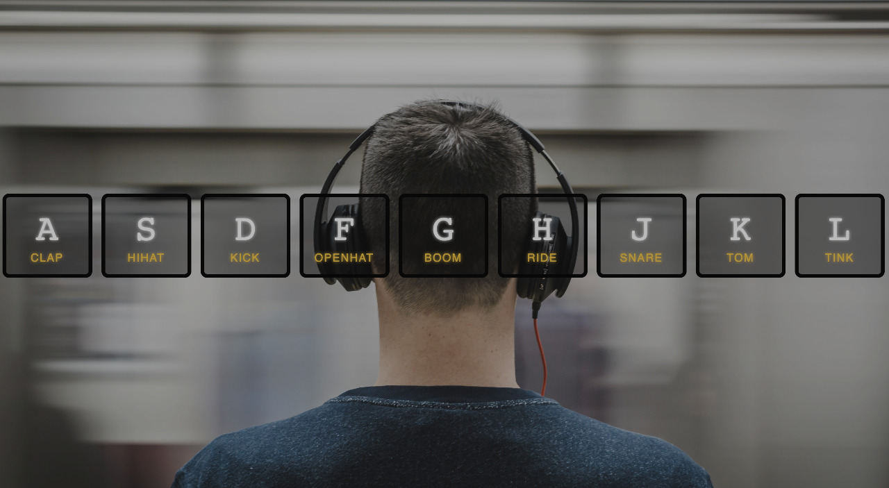

# Sounds Play Page

## Desafio 🎯
Criar uma página com uma imagem de fundo, uma linha no centro da página com vários blocos, e inserir um conteúdo dentro de cada bloco de acordo com a imagem acima.  

  
    
## Por onde posso começar? 💪🏽
- Você pode usar: 
  - [Codepen](https://codepen.io/) - O codpen é um editor de código on-line muito utilizado, onde você pode armazenar e compartilhar os seus códigos. Para obter mais detalhes você pode acessar [esse link.](https://blog.codepen.io/2016/02/01/learn-how-the-editor-works-the-editor-tour/)
  - [Glitch](https://glitch.com/) - pra saber o que é o Glitch você pode [entrar aqui](https://medium.com/glitch/what-is-glitch-90cd75e40277), você encontra maiores informações sobre o Glitch [aqui também.](https://medium.com/@glitch)  
  

## Manda umas dicas aí! 😱
- Primeira etapa, incluir uma imagem como plano de fundo:
  - Para incluirmos uma imagem como plano de fundo precisamos usar a propriedade `background-image` no `CSS`. [Nesse link](http://htmldog.com/references/css/properties/background-image/) você encontra mais detalhes sobre essa propriadade.
- Segunda etapa, criar uma `div` que tem vários elementos (que podem ser outras divs) como filho, posicioná-la no centro da tela.
  - Para posicionar os blocos centralizado na página, você pode usar as propriedade `justify-content` e `align-items` do `Flexbox`, [nesse artigo](https://css-tricks.com/snippets/css/a-guide-to-flexbox/) você pode encontrar a descrição dessas propriedades.
- Esse layout é uma cópia do curso JS 30Days, você pode [acessá-lo aqui](https://javascript30.com/) para obter mais informações.
- Se você tiver qualquer dúvida ou se sentir `travada` em qualquer parte do desafio, não se desespere, esse processo é perfeitamente normal e acontece todas as vezes que somos introduzidas a algo novo, essa etapa faz parte do processo de aprendizagem, você não está sozinha, a qualquer momento você pode gritar por ajuda no nosso grupo privado, tem sempre alguém disposto a te dar aquele empurrãozinho pra você decolar 🌈, [acessa aqui](https://www.instagram.com/reactladies/) a nossa page solicitando o acesso ao grupo e vamos juntas nesse desafio 💃🏽  

---  

## Se você achou legou esse desafio e tentou fazer, adiciona aqui o link da tua solução pra gente ver também 😍  

## Quem já fez???
1 - [Camila](https://codepen.io/camilars/pen/zybNzv)      
2 - [Letícia](https://codepen.io/leehmaciel/pen/ebXzem)    
3 - [Raquel](https://codepen.io/raquel-ods/pen/VqNexG)   
4 - [Débora](https://codepen.io/Debbiemars/pen/OrGrwG)   
5 - [Dhebbora](https://codepen.io/dhebbora/pen/OrYoXE)    
6 - [Andrielly](https://codepen.io/dryalves/pen/REXwyW)  
7 - [Dani](https://codepen.io/daniela-rego/pen/PXrvmL?editors=1100#0) 
8 - [Nelkisa] (https://gifted-holiday.glitch.me/) 

