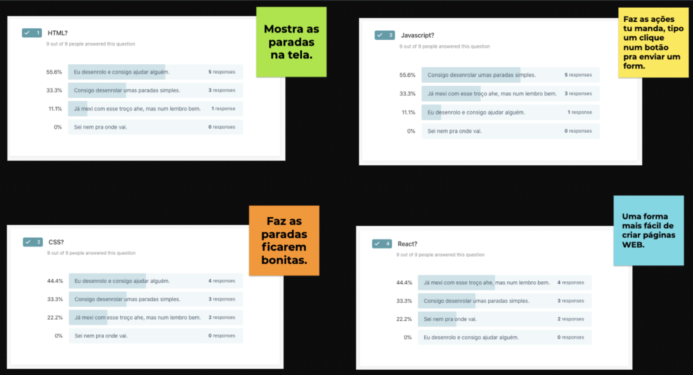
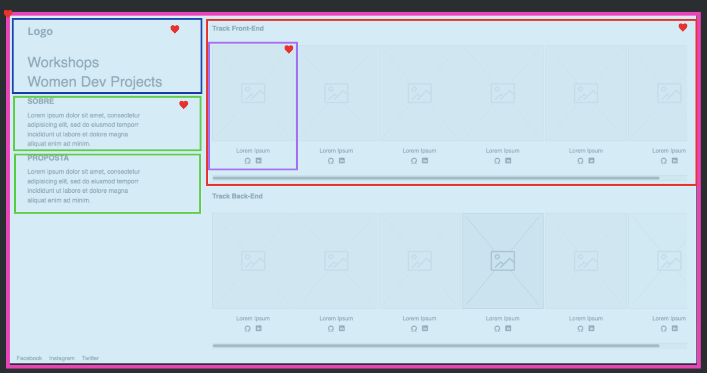

# Olar Monas

# O que vamos usar?

- [CodeSandbox](https://codesandbox.io/index2)
- [Glitch](https://glitch.com/)
- [zoom meetings](https://zoom.us/)

# O que vamos ver hoje?

## Como que é esse negócio de Front-end?

## O que tem pra hoje?

- [ ]  Components
- [ ]  Onde está o HTML mesmo?
- [ ]  Variável.
- [ ]  JSX
- [ ]  Escrevendo JS no retorno da função
- [ ]  Função
- [ ]  [Alguns atributos são escritos diferentes entre o React e o HTML...](https://reactjs.org/docs/dom-elements.html)
- [ ]  Props
- [ ]  Eventos
- [ ]  Estados
- [ ]  ES Modulos

> Não vamos usar componentes de classes, se precisar alterar estados usaremos o hooks.

## Referências

- [The HTML Handbook](https://www.freecodecamp.org/news/the-html-handbook/)
- [The CSS Handbook: a handy guide to CSS for developers](https://www.freecodecamp.org/news/the-css-handbook-a-handy-guide-to-css-for-developers-b56695917d11/)
- [Everything HTML, CSS, and JavaScript,the most common languages used in making web pages.](https://htmldog.com/)
- [html-reference](https://htmlreference.io/)
- [css-reference](https://cssreference.io/)
- [front-end-handbook](https://frontendmasters.com/books/front-end-handbook/2019/#1)

## Desafio

